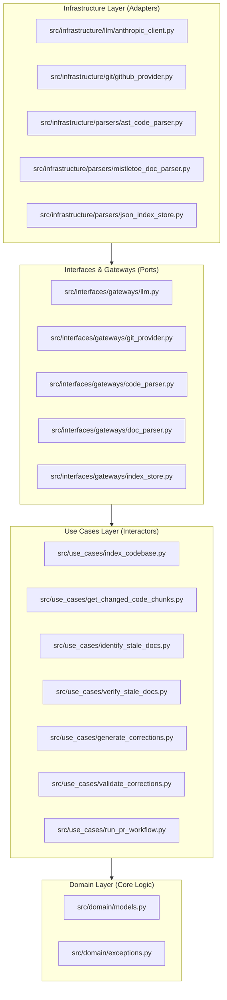

# Self-Healing Technical Documentation

An automated, LLM-powered documentation maintenance tool that monitors code changes in Pull Requests and automatically repairs stale or outdated markdown documentation.

It runs seamlessly as a Docker-based GitHub Action or as a standalone CLI utility.

---

## 🚀 Key Capabilities

- **Automatic Staleness Detection**: Analyzes git unified diffs in a Pull Request, identifies changed code constructs (functions, classes, schemas, and routes), and checks them against linked documentation sections.
- **AST Code Parser**: Parses source files into semantic chunks, resolving route decorators (e.g., `@router.post()`), positional configurations, Click CLI options, Pydantic schemas, and class hierarchies.
- **Markdown Document Segmenter**: Segments large markdown docs into hierarchical sections using heading lines and extracts inline code block references.
- **Verification & Generation (Claude Sonnet 4.6)**: Compares changed AST chunk pre-images against their documentation counterparts using LLM-backed verification to identify inaccuracies.
- **Double-Pass Validation Quality Gate**: Re-reviews suggested edits using a second LLM validation pass (`is_valid`) to eliminate hallucinations, style drift, or documentation corruption.
- **Branch and PR Automation**: For high-confidence updates, it automatically creates a new branch, pushes the corrected files, and opens a new Pull Request. For low-confidence updates, it flags the section and leaves a descriptive draft summary comment on the original PR.

---

## 🛠️ Tech Stack

- **Core Runtime**: Python 3.12 (standard library `ast` parsing, `subprocess`, and file I/O).
- **Markdown Parsing**: `mistletoe` for structured header tree segmentation.
- **API Communication**: Native integration with the Anthropic SDK and HTTP clients (using `httpx` to handle rate-limiting and custom base URLs like OpenAgentic.id).
- **GitHub Action Packaging**: Docker-based Action (`action.yml` & `Dockerfile`).
- **Testing**: `pytest` and `anyio` for asynchronous testing.
- **Code Quality**: `ruff` for linting and formatting.

---

## 🏗️ Architecture

The codebase adheres strictly to **Clean Architecture** patterns:



- **Domain**: Contains plain data models (`CodeChunk`, `DocSection`, `DocPatch`, `VerificationResult`) and base custom exception definitions.
- **Use Cases**: Implements high-level application workflows.
- **Interfaces**: Defines abstraction ports to isolate business logic from databases, external APIs, and network protocols.
- **Infrastructure**: Implementations of external adapters (Anthropic client, Git provider, AST parser, Markdown segmenter, and JSON index persistence).

---

## ⚙️ How to Run

### 1. Local Setup
Clone the repository and install development dependencies in a virtual environment:

```bash
python3 -m venv .venv
source .venv/bin/activate
pip install -r requirements.txt -r requirements-dev.txt
```

Create a `.env` file from the sample:
```bash
cp .env.sample .env
```
Fill in the configuration details inside `.env`:
- `OPENAGENTIC_API_KEY` (or `ANTHROPIC_API_KEY`)
- `GITHUB_TOKEN` (for pull request creations and comments)
- `WORKSPACE_DIR` (absolute path of the target codebase)

### 2. Building the Link Index
Before the self-healing scanner can run, you must build the relationship index mapping the codebase entities to technical document headings. Run the indexer:

```bash
# Indexes the target project codebase and saves to docs_index.json
make index
```

### 3. Running the Pipeline Locally
Run the self-healing workflow on the target repository to detect and correct stale docs:

```bash
# Analyzes git diff, verifies accuracy, and outputs corrections
make run
```

### 4. Running Tests & Linters
```bash
# Run test suite
make test

# Format code
make format

# Check lint rules
make lint
```

---

## 📦 GitHub Action Integration

To run this pipeline automatically on pull requests in a target repository, add a workflow file (e.g. `.github/workflows/self-healing.yml`):

```yaml
name: Self-Healing Technical Documentation

on:
  pull_request:
    paths:
      - '**.py' # Run when python codebase files are modified

jobs:
  check-docs:
    runs-on: ubuntu-latest
    steps:
      - name: Checkout Code
        uses: actions/checkout@v4
        with:
          fetch-depth: 0 # Fetch all history for git diff parsing

      - name: Run Self-Healing Docs
        uses: novriantama/self-healing-technical-documentation@main
        with:
          llm_api_key: ${{ secrets.OPENAGENTIC_API_KEY }}
          confidence_threshold: '0.8'
          auto_merge: 'true'
        env:
          OPENAGENTIC_API_KEY: ${{ secrets.OPENAGENTIC_API_KEY }}
          OPENAGENTIC_BASE_URL: 'https://openagentic.id/api/v1'
          OPENAGENTIC_MODEL: 'claude-sonnet-4.6'
          GITHUB_TOKEN: ${{ secrets.GITHUB_TOKEN }}
```