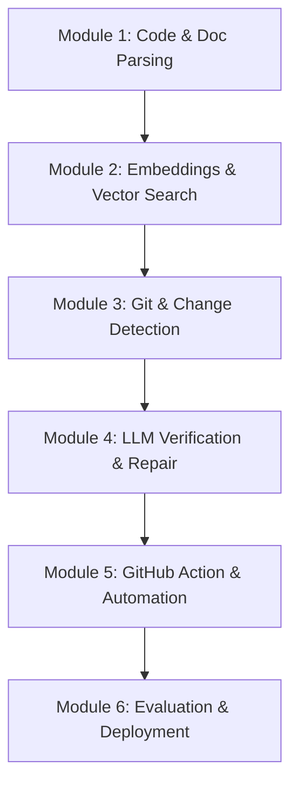

# **Learning Path: Building Self-Healing Technical Documentation**

This learning path is designed to guide you step-by-step through the concepts, tools, and algorithms required to implement the [Self-Healing Technical Documentation](file:///Users/hafidz/Projects/self-healing-technical-documentation/docs/Self-Healing%20Technical%20Documentation.md) pipeline. 

By following this curriculum, you will transition from learning core abstract syntax tree (AST) manipulation to building and deploying a production-ready, AI-driven GitHub Action.

---

## **Curriculum Overview**



---

## **Module 1: Code & Document Parsing**
*Understand how to programmatically read and chunk both source code and natural language documentation.*

### **1. Code Parsing (ASTs)**
To track code changes, you cannot treat code as plain text. You must understand its semantic structure.
* **Concepts to Learn:**
  * What is an Abstract Syntax Tree (AST)?
  * Nodes, traversals, and lexical scope.
  * Storing code metadata (line numbers, parameter lists, docstrings).
* **Recommended Libraries:**
  * **Python:** Standard library [`ast`](https://docs.python.org/3/library/ast.html) module (`ast.NodeVisitor`, `ast.parse`).
  * **Multi-language:** [Tree-sitter](https://tree-sitter.github.io/tree-sitter/) (for parsing TypeScript, Go, Java, etc.).

#### **Parsing Walkthrough & Implementation Details**
To parse Python code using `ast`, subclass `ast.NodeVisitor` to target node types of interest.
```python
import ast

class CodeParser(ast.NodeVisitor):
    def __init__(self, filepath):
        self.filepath = filepath
        self.chunks = []

    def visit_FunctionDef(self, node):
        # Extract arguments and types
        args = [arg.arg for arg in node.args.args]
        
        # Get start/end line bounds
        start_line = node.lineno
        end_line = getattr(node, "end_lineno", start_line)
        
        # Extract docstring if present
        docstring = ast.get_docstring(node) or ""

        self.chunks.append({
            "id": f"{self.filepath}::{node.name}",
            "name": node.name,
            "type": "function",
            "signature": f"{node.name}({', '.join(args)})",
            "docstring": docstring.strip(),
            "start_line": start_line,
            "end_line": end_line
        })
        self.generic_visit(node)
```

#### **Expected Exercises & Inputs/Outputs**
1. **Exercise 1 (Code Chunking):** Create a script `src/parsers/code_parser.py` that takes a path to a python file, runs the visitor, and outputs a JSON file containing the extracted chunks.
   * **Input (`src/math_helper.py`):**
     ```python
     def calculate_tax(price: float, rate: float = 0.05) -> float:
         """Calculates the total tax for a given price."""
         return price * rate
     ```
   * **Expected Output JSON:**
     ```json
     [
       {
         "id": "src/math_helper.py::calculate_tax",
         "name": "calculate_tax",
         "type": "function",
         "signature": "calculate_tax(price, rate)",
         "docstring": "Calculates the total tax for a given price.",
         "start_line": 1,
         "end_line": 3
       }
     ]
     ```

---

### **2. Documentation Parsing**
Documentation is typically formatted in Markdown. You need to split it into logical chunks to analyze it.
* **Concepts to Learn:**
  * Parsing Markdown into structural components (headers, paragraphs, code blocks).
  * Building a document hierarchy based on heading levels (`#`, `##`, `###`).
* **Recommended Libraries:**
  * **Python:** `mistletoe`, `mistune`, or `markdown-it-py`.

#### **Parsing Walkthrough & Implementation Details**
You can divide markdown text into chunks using heading splits. Alternatively, use `mistletoe` to read tokens programmatically.
A simpler method splits the markdown file via regex along lines starting with `#` and keeps track of the header path:
```python
import re

def parse_markdown(filepath):
    with open(filepath, "r") as f:
        content = f.read()
    
    # Split by headings while keeping the headings
    sections = re.split(r"^(#+ .+)$", content, flags=re.MULTILINE)
    
    chunks = []
    current_header_path = []
    
    # Iterate through sections and match headers vs body contents
    for item in sections:
        item = item.strip()
        if not item:
            continue
        
        if item.startswith("#"):
            level = len(re.match(r"^#+", item).group(0))
            header_title = item.lstrip("#").strip()
            
            # Maintain the hierarchy stack
            while len(current_header_path) >= level:
                current_header_path.pop()
            current_header_path.append(header_title)
        else:
            if current_header_path:
                heading_path = " > ".join(current_header_path)
                # Find backticked code symbols inside the body (heuristics)
                code_mentions = re.findall(r"`([^`]+)`", item)
                
                chunks.append({
                    "heading_path": heading_path,
                    "content": item,
                    "references": list(set(code_mentions))
                })
    return chunks
```

---

## **Module 2: Embeddings & Vector Search**
*Learn how to bridge the gap between code and documentation using semantic search.*

### **1. Vector Embeddings & Databases**
* **Concepts to Learn:**
  * Semantic representation of code and text.
  * Distance metrics: Cosine Similarity, L2 Distance, Dot Product.
  * Local/serverless vs. hosted vector databases.
* **Recommended Libraries & APIs:**
  * **Embeddings:** OpenAI API (`text-embedding-3-small`) or HuggingFace Transformers (e.g., `all-MiniLM-L6-v2`).
  * **Vector Database:** [ChromaDB](https://docs.trychroma.com/) (running in-memory or persisted locally to disk).

#### **Vector Storage Workflow**
Use `chromadb` to initialize a persistent vector store directly in your workspace directory.
```python
import chromadb
from openai import OpenAI

# Initialize OpenAI & Chroma clients
client = OpenAI(api_key="your-api-key")
chroma_client = chromadb.PersistentClient(path="./.chroma_db")
collection = chroma_client.get_or_create_collection(name="docs_sections")

def get_embedding(text, model="text-embedding-3-small"):
    response = client.embeddings.create(input=[text], model=model)
    return response.data[0].embedding

# Add chunks to collection
doc_chunks = parse_markdown("docs/Self-Healing Technical Documentation.md")
for i, chunk in enumerate(doc_chunks):
    embedding = get_embedding(chunk["content"])
    collection.add(
        documents=[chunk["content"]],
        embeddings=[embedding],
        metadatas=[{"heading_path": chunk["heading_path"], "references": ",".join(chunk["references"])}],
        ids=[f"doc_chunk_{i}"]
    )
```

#### **Linking Algorithm: Building the Link Graph**
To construct the initial code-to-docs link graph:
1. **Explicit Search:** For each code chunk (e.g., function name `calculate_tax`), query the vector DB.
2. **Metadata Search:** Look up sections where `references` contains the function name exactly.
3. **Semantic Similarity Search:** Search documents where semantic similarity is above 0.70.
4. **Export Index:** Save the matches in `docs/index.json`.

* **Expected Output format of `docs/index.json`:**
  ```json
  {
    "src/math_helper.py::calculate_tax": [
      "Finance Module > Tax Calculation",
      "API > Calculation Endpoints"
    ]
  }
  ```

---

## **Module 3: Git & Change Detection**
*Learn to monitor code modifications and trace them back to the semantic blocks they belong to.*

### **1. Git Diff Parsing**
* **Concepts to Learn:**
  * The unified diff format (`git diff`).
  * Tracking added, deleted, and modified lines.
  * Mapping physical line changes to AST nodes.
* **Recommended Libraries:**
  * **Python:** `whatthepatch` (easy extraction of modified lines).

#### **Change Extraction Implementation**
When code changes in a Pull Request, Git outputs a diff. You must parse this diff to identify modified lines.
```python
import whatthepatch

def get_modified_lines(diff_text):
    """
    Parses a unified diff and returns a dict mapping file path -> set of modified line numbers
    """
    modified_files = {}
    for diff in whatthepatch.parse_patch(diff_text):
        if not diff.header or not diff.changes:
            continue
        
        filepath = diff.header.new_path
        modified_lines = set()
        
        for change in diff.changes:
            # new_line refers to the line number in the modified version of the file
            if change.new is not None:
                modified_lines.add(change.new)
        
        modified_files[filepath] = modified_lines
    return modified_files
```

#### **Overlay Mapping Algorithm**
Compare the lines modified in the diff with the line range boundaries (`[start_line, end_line]`) of function and class chunks generated in Module 1:
```python
def find_affected_chunks(parsed_code_chunks, modified_lines_dict):
    affected = []
    for chunk in parsed_code_chunks:
        filepath = chunk["id"].split("::")[0]
        if filepath in modified_lines_dict:
            # Check overlap between chunk lines and git modified lines
            chunk_lines = set(range(chunk["start_line"], chunk["end_line"] + 1))
            if chunk_lines.intersection(modified_lines_dict[filepath]):
                affected.append(chunk)
    return affected
```

---

## **Module 4: LLM-Driven Verification & Repair**
*Master prompt engineering and structured outputs to decide if docs are stale and correct them.*

### **1. Staleness Verification (Classification)**
* **Concepts to Learn:**
  * Structured output extraction using Pydantic schemas.
  * Formulating context parameters.
* **Recommended APIs & SDKs:**
  * Anthropic Python SDK (utilizing `claude-3-5-sonnet`, `claude-3-7-sonnet`, or `claude-4-6-sonnet` via Messages API with tool use/structured outputs).
* **Pydantic Schema for LLM Classification:**
```python
from pydantic import BaseModel, Field

class VerificationSchema(BaseModel):
    is_stale: bool = Field(description="True if the documentation section is inaccurate/stale given the code change.")
    confidence: float = Field(description="Confidence score between 0.0 and 1.0.")
    explanation: str = Field(description="Detailed explanation of what is inaccurate or mismatched, if is_stale is True.")
```

#### **Staleness Prompts**
Configure a system prompt that takes:
* The original code snippet.
* The modified version of the code.
* The text of the documentation section.

* **Sample Classifier Prompt:**
  ```text
  You are an expert technical editor. Your job is to verify if a code change makes a specific documentation section outdated.
  
  --- CODE CHANGES ---
  Old Code:
  {old_code}
  
  New Code:
  {new_code}
  
  --- DOCUMENTATION SECTION ---
  {doc_section_content}
  
  Review the documentation section. Is it still accurate given the changes made from the old code to the new code?
  ```

---

### **2. Documentation Repair**
* **Concepts to Learn:**
  * Prompt templates for updating documentation.
  * Quality validation gates.

#### **Repair Prompts**
* **Sample Repair Prompt:**
  ```text
  You are an expert technical writer.
  
  Modify the following documentation section to align with the new code changes. Keep the tone, style, and structure identical to the original doc. Fix ONLY what is incorrect. Do not add metadata, comments, or annotations.
  
  Original Doc:
  {doc_section_content}
  
  New Code Implementation:
  {new_code}
  
  Staleness Details:
  {explanation}
  
  Updated Documentation:
  ```

---

## **Module 5: GitHub Action & Automation**
*Package your logic as a reusable DevOps tool and integrate it directly into GitHub repositories.*

### **1. Action Architecture**
You will build a **Docker-based GitHub Action**. This packages your Python environment (including PyGithub, Chroma, Anthropic SDK) as a self-contained container.

#### **`action.yml` Specification**
Create an `action.yml` at the root of the project to tell the GitHub Actions runner how to execute your action:
```yaml
name: "Self-Healing Technical Docs"
description: "Detects documentation that has become stale due to code changes and generates PRs to repair them"
author: "Your Name"
inputs:
  anthropic_api_key:
    description: "API key for Anthropic to classify and fix documentation using Claude Sonnet 4.6"
    required: true
  confidence_threshold:
    description: "Threshold above which documentation patches are automatically committed"
    default: "0.8"
    required: false
runs:
  using: "docker"
  image: "Dockerfile"
```

#### **`Dockerfile` Specification**
Create a `Dockerfile` that sets up the required environment:
```dockerfile
FROM python:3.11-slim

WORKDIR /app

RUN apt-get update && apt-get install -y git && rm -rf /var/lib/apt/lists/*

COPY requirements.txt .
RUN pip install --no-cache-dir -r requirements.txt

COPY src/ /app/src/

ENTRYPOINT ["python", "/app/src/main.py"]
```

#### **PR Automation script (PyGithub)**
Write a helper script in your Python code to open PRs and post status updates:
```python
from github import Github
import os

def create_documentation_pr(repo_name, branch_name, file_path, updated_content, title, body):
    # Retrieve the token from environment variables set by GitHub Action
    token = os.environ["GITHUB_TOKEN"]
    g = Github(token)
    repo = g.get_repo(repo_name)
    
    # 1. Create a new branch off default branch
    sb = repo.get_branch("main")
    repo.create_git_ref(ref=f"refs/heads/{branch_name}", sha=sb.commit.sha)
    
    # 2. Update the file in the new branch
    file = repo.get_contents(file_path, ref=branch_name)
    repo.update_file(
        path=file.path,
        message="docs: automatic fix for stale documentation",
        content=updated_content,
        sha=file.sha,
        branch=branch_name
    )
    
    # 3. Create the PR
    pr = repo.create_pull(title=title, body=body, head=branch_name, base="main")
    return pr.html_url
```

---

## **Module 6: Evaluation & Deployment**
*Validate your tool on real-world projects, track accuracy metrics, and publish to the marketplace.*

### **1. Testing & Benchmark Metrics**
Before deploying your tool, you should run it against a benchmark of synthetic and real code changes. Track performance using a validation matrix:

| Test Case ID | Code Change Type | Target Doc Section | Expected Staleness | Actual Classification | Fixed Correctly? |
| :--- | :--- | :--- | :--- | :--- | :--- |
| TC-01 | Rename Parameter | Parameter description | True (Stale) | True (Stale) | Yes |
| TC-02 | Change Internal Loop | Detail implementation | False (Accurate)| False (Accurate)| N/A |
| TC-03 | Add configuration key| Config table | True (Stale) | False (Accurate)| No (False Neg) |

#### **Metrics Tracking:**
Calculate:
* **Precision:** $\frac{\text{True Positives}}{\text{True Positives} + \text{False Positives}}$ (Goal: > 90% to avoid annoying developers with incorrect flags).
* **Recall:** $\frac{\text{True Positives}}{\text{True Positives} + \text{False Negatives}}$ (Goal: > 80% to ensure we catch most stale documentation).

---

## **Curriculum Milestones & Target Timeline**

| Milestone | Expected Goal | Est. Time |
| :--- | :--- | :--- |
| **Milestone 1** | Code & Doc AST parsing CLI that outputs JSON | Days 1–3 |
| **Milestone 2** | DB indexing and semantic linking script | Days 4–5 |
| **Milestone 3** | Git diff mapper showing list of modified code/doc suspects | Days 6–7 |
| **Milestone 4** | Dual-LLM verification & repair script | Days 8–9 |
| **Milestone 5** | Containerized Action running locally in Docker simulating PR | Days 10–11 |
| **Milestone 6** | Published GitHub Action running on test repo with metrics | Days 12–14 |

---

## **Where to Start?**
1. Read the core design specifications in the [Self-Healing Technical Documentation.md](file:///Users/hafidz/Projects/self-healing-technical-documentation/docs/Self-Healing%20Technical%20Documentation.md) file.
2. Setup a workspace with Python 3.11+, and create a directory named `src/` to hold your implementation files.
3. Start on **Module 1 (Code Parsing)** by investigating Python's standard `ast` library.
