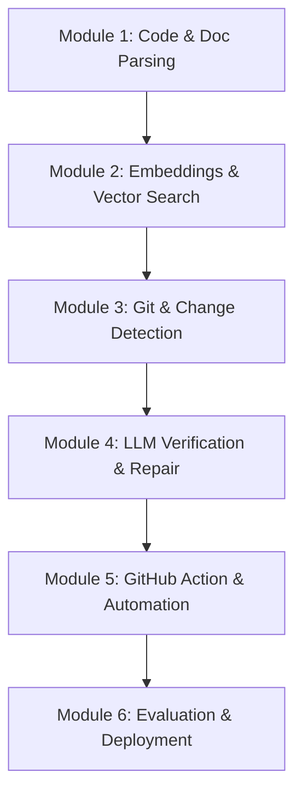

# **Learning Path: Building Self-Healing Technical Documentation**

This learning path is designed to guide you step-by-step through the concepts, tools, and algorithms required to implement the [Self-Healing Technical Documentation](file:///Users/hafidz/Projects/self-healing-technical-documentation/docs/Self-Healing%20Technical%20Documentation.md) pipeline. 

By following this curriculum, you will transition from learning core abstract syntax tree (AST) manipulation to building and deploying a production-ready, AI-driven GitHub Action.

---

## **Curriculum Overview**

---

## **Module 1: Code & Document Parsing**
*Understand how to programmatically read and chunk both source code and natural language documentation.*

### **1. Code Parsing (ASTs)**
To track code changes, you cannot treat code as plain text. You must understand its semantic structure.
* **Concepts to Learn:**
  * What is an Abstract Syntax Tree (AST)?
  * Nodes, traversals, and lexical scope.
  * Storing code metadata (line numbers, parameter lists, docstrings).
* **Recommended Libraries:**
  * **Python:** Standard library [`ast`](https://docs.python.org/3/library/ast.html) module (`ast.NodeVisitor`, `ast.parse`).
  * **Multi-language:** [Tree-sitter](https://tree-sitter.github.io/tree-sitter/) (for parsing TypeScript, Go, Java, etc.).
* **Exercises:**
  1. Write a script that parses a Python file and extracts all function names, their arguments, their starting and ending lines, and their docstrings. Output this as a structured JSON array.
  2. Implement the same parser for a class structure, capturing methods and instance variables.

### **2. Documentation Parsing**
Documentation is typically formatted in Markdown. You need to split it into logical chunks to analyze it.
* **Concepts to Learn:**
  * Parsing Markdown into structural components (headers, paragraphs, code blocks).
  * Building a document hierarchy based on heading levels (`#`, `##`, `###`).
* **Recommended Libraries:**
  * **Python:** `mistletoe`, `mistune`, or `markdown-it-py`.
* **Exercises:**
  1. Write a parser that reads a markdown file, splits it by headings, and returns each section with its heading path (e.g., `Installation > Local Development`) and raw content.
  2. Write a regex or keyword extractor to find code references (e.g., function names, backticked identifiers like `` `my_function()` ``) inside each documentation section.

---

## **Module 2: Embeddings & Vector Search**
*Learn how to bridge the gap between code and documentation using semantic search.*

### **1. Vector Embeddings & Databases**
* **Concepts to Learn:**
  * Semantic representation of code and text.
  * Distance metrics: Cosine Similarity, L2 Distance, Dot Product.
  * Local/serverless vs. hosted vector databases.
* **Recommended Libraries & APIs:**
  * **Embeddings:** OpenAI API (`text-embedding-3-small`) or HuggingFace Transformers (e.g., `all-MiniLM-L6-v2`).
  * **Vector Database:** [ChromaDB](https://docs.trychroma.com/) (running in-memory or persisted locally to disk).
* **Exercises:**
  1. Write a script to generate embeddings for all code chunks (from Module 1) and documentation sections (from Module 1).
  2. Index these embeddings in a local ChromaDB collection.
  3. Create a query function: given a code chunk, retrieve the top 3 most semantically similar documentation sections.
  4. Build a hybrid linking heuristic: combine string match heuristics (e.g., exact matches of function names) with embedding similarities (e.g., similarity score > 0.7) to build a relational graph. Save this graph to a file `index.json`.

---

## **Module 3: Git & Change Detection**
*Learn to monitor code modifications and trace them back to the semantic blocks they belong to.*

### **1. Git Diff Parsing**
* **Concepts to Learn:**
  * The unified diff format (`git diff`).
  * Tracking added, deleted, and modified lines.
  * Mapping physical line changes to AST nodes.
* **Recommended Libraries:**
  * **Python:** `unidiff` or `whatthepatch`.
* **Exercises:**
  1. Create a script that reads a raw git diff and extracts:
     * File paths modified.
     * Specific line ranges added/removed/changed.
  2. Write a function that maps the changed line ranges back to the AST parser outputs from Module 1. Identify exactly which function or class was modified.
  3. Implement filtering rules to ignore trivial changes:
     * Whitespace-only edits.
     * Comments edits.
     * Changes to test files (e.g., `tests/test_*.py`).

---

## **Module 4: LLM-Driven Verification & Repair**
*Master prompt engineering and structured outputs to decide if docs are stale and correct them.*

### **1. Staleness Verification (Classification)**
* **Concepts to Learn:**
  * Cost-effective filtering of false positives.
  * Few-shot prompting.
  * Structured output extraction (ensuring JSON responses from LLMs).
* **Recommended APIs:**
  * OpenAI Chat Completion (GPT-4o/GPT-4o-mini) or Anthropic Messages API (Claude Sonnet).
* **Exercises:**
  1. Write a system prompt that inputs:
     * The old code chunk.
     * The new code chunk (or the git diff).
     * The linked documentation section.
  2. Instruct the LLM to classify if the documentation is still accurate (True/False) and provide a concise reason if False. Use Pydantic/JSON schemas to enforce a structured response.

### **2. Documentation Repair**
* **Concepts to Learn:**
  * Context injection for code refactoring.
  * Tone and style preservation in LLM generation.
  * Self-correction loop: using a second LLM prompt to validate the correction output.
* **Exercises:**
  1. Design a prompt that takes the stale documentation section and the code modification, and outputs a repaired version of the documentation section.
  2. Write a validation agent: a second LLM call that compares the updated doc with the code to check for hallucinated APIs or style mismatches.
  3. Implement a confidence scorer: if the model marks the edit with high confidence, proceed to auto-fix; if low confidence, mark with a `TODO` for manual verification.

---

## **Module 5: GitHub Action & Automation**
*Package your logic as a reusable DevOps tool and integrate it directly into GitHub repositories.*

### **1. GitHub Actions Development**
* **Concepts to Learn:**
  * Action types: Javascript vs. Docker container actions.
  * Action metadata (`action.yml`).
  * Accessing environment variables and inputs.
* **Recommended Tools:**
  * Docker.
  * PyGithub (Python library for interacting with the GitHub API).
* **Exercises:**
  1. Containerize your Python scripts from previous modules using a `Dockerfile`.
  2. Define an `action.yml` file to expose configuration inputs (API keys, confidence threshold, paths to exclude) and outputs.
  3. Write a Python script using `PyGithub` to:
     * Fetch pull request details (files modified, diffs).
     * Create a new branch and push documentation updates.
     * Open a new Pull Request with the documentation fixes.
     * Comment on the original PR with a status summary of the check.

---

## **Module 6: Evaluation & Deployment**
*Validate your tool on real-world projects, track accuracy metrics, and publish to the marketplace.*

### **1. Testing & Benchmark Metrics**
* **Concepts to Learn:**
  * Information retrieval metrics: Precision, Recall, F1-score.
  * Synthesizing testing scenarios for documentation decay.
* **Exercises:**
  1. Create a "testbed" repository containing a simple codebase and corresponding documentation.
  2. Run a battery of simulated updates (e.g., changing parameters, renaming functions, adding new endpoints) and measure:
     * **Recall:** Did the system catch all documentation updates that were actually needed?
     * **Precision:** Did it avoid flagging documentation sections that didn't need updates?
  3. Document the performance metrics and limitations in your README.

### **2. CI/CD Publishing**
* **Concepts to Learn:**
  * Semantic versioning for GitHub Actions.
  * Publishing to the GitHub Actions Marketplace.
  * Writing documentation and instructions for end-users to adopt the action.
* **Exercises:**
  1. Tag your action with a semantic version release (`v1.0.0`).
  2. Create a release on GitHub to publish it to the Marketplace.
  3. Record a short demo video showing the Action in action: a PR modifying code -> the Action running -> doc fix PR created.

---

## **Curriculum Milestones & Target Timeline**

| Milestone | Expected Goal | Est. Time |
| :--- | :--- | :--- |
| **Milestone 1** | Code & Doc AST parsing CLI that outputs JSON | Days 1–3 |
| **Milestone 2** | DB indexing and semantic linking script | Days 4–5 |
| **Milestone 3** | Git diff mapper showing list of modified code/doc suspects | Days 6–7 |
| **Milestone 4** | Dual-LLM verification & repair script | Days 8–9 |
| **Milestone 5** | Containerized Action running locally in Docker simulating PR | Days 10–11 |
| **Milestone 6** | Published GitHub Action running on test repo with metrics | Days 12–14 |

---

## **Where to Start?**
1. Read the core design specifications in the [Self-Healing Technical Documentation.md](file:///Users/hafidz/Projects/self-healing-technical-documentation/docs/Self-Healing%20Technical%20Documentation.md) file.
2. Setup a workspace with Python 3.11+, and create a directory named `src/` to hold your implementation files.
3. Start on **Module 1 (Code Parsing)** by investigating Python's standard `ast` library.
